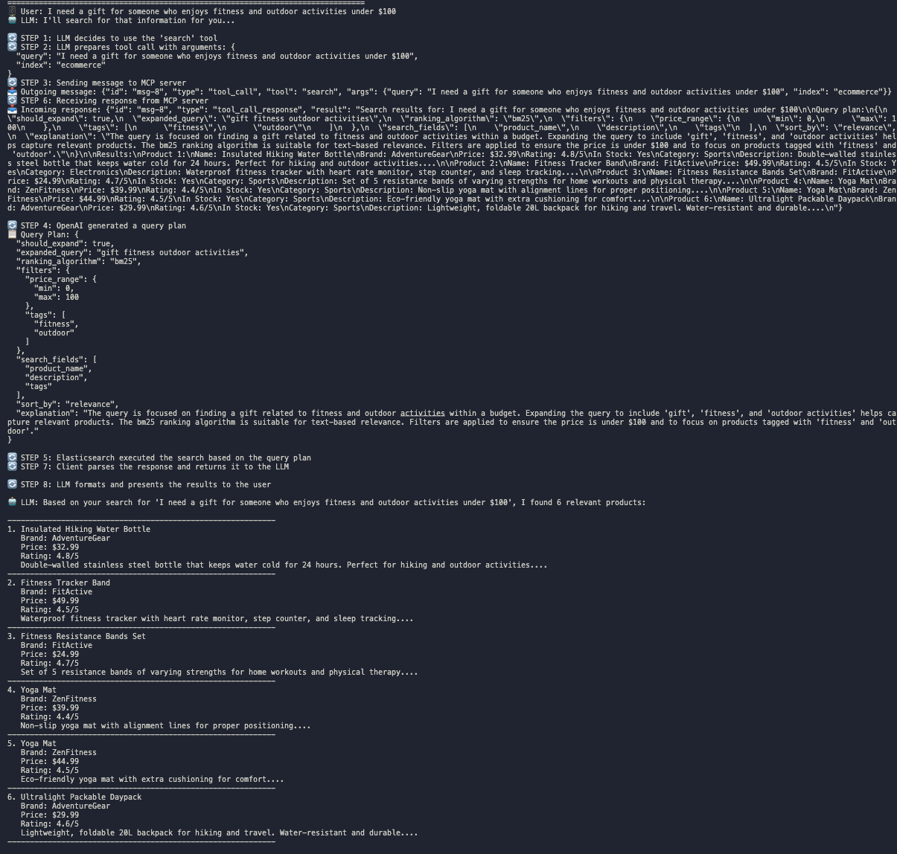

# Search MCP

An MCP (Machine Conversation Protocol) demo for keyword search with Elasticsearch and LLM query planning.

## Overview

This project demonstrates how to use LLMs to enhance search functionality through:

- LLM-powered query planning
- Query expansion
- Intelligent filtering and categorization
- Result formatting and presentation

The main demo script `llm_search_mcp_demo.py` shows the full power of combining LLMs with Elasticsearch for e-commerce search.

## Complete Setup Guide

### Prerequisites

- macOS or Linux system
- Python 3.10 or higher
- Docker (for Elasticsearch)
- OpenAI API key

### Step 1: Clone the Repository

```bash
git clone <repository-url>
cd search_mcp
```

### Step 2: Install Poetry

Poetry is used for dependency management. If you don't have Poetry installed:

**macOS/Linux:**

```bash
curl -sSL https://install.python-poetry.org | python3 -
```

Add Poetry to your PATH (add this to your .bashrc or .zshrc):

```bash
export PATH="$HOME/.local/bin:$PATH"
```

Verify installation:

```bash
poetry --version
```

### Step 3: Install Dependencies

```bash
# Install dependencies without installing the project as a package
poetry install --no-root
```

> **Note:** We use the `--no-root` flag to avoid package installation issues, as this project is meant to be run directly, not installed as a package.

### Step 4: Set Up Elasticsearch

The easiest way to run Elasticsearch is using Docker:

```bash
# Pull the Elasticsearch Docker image
docker pull docker.elastic.co/elasticsearch/elasticsearch:8.12.2

# Start Elasticsearch container
docker run -d --name elasticsearch \
  -p 9200:9200 -p 9300:9300 \
  -e "discovery.type=single-node" \
  -e "xpack.security.enabled=false" \
  docker.elastic.co/elasticsearch/elasticsearch:8.12.2
```

Verify Elasticsearch is running:

```bash
curl http://localhost:9200
```

### Step 5: Configure Environment Variables

Create a `.env` file in the project root:

```bash
cp .env.example .env
```

Edit the `.env` file and add your OpenAI API key:

```
# Elasticsearch configuration
ELASTICSEARCH_HOST=http://localhost:9200
ELASTICSEARCH_USER=
ELASTICSEARCH_PASSWORD=
ELASTICSEARCH_INDEX=ecommerce

# OpenAI configuration
OPENAI_API_KEY=your_openai_api_key_here
OPENAI_MODEL=gpt-3.5-turbo
```

### Step 6: Run the Demo

Now you can run the enhanced LLM demo:

```bash
poetry run python llm_search_mcp_demo.py
```

This will:

1. Start the MCP server
2. Create a test e-commerce index with sample products
3. Demonstrate LLM-powered search queries
4. Show detailed step-by-step operation of the search system

## How It Works

The demo demonstrates all steps of the search process:

1. **Starting the MCP server**: The server provides tools for searching and indexing data
2. **Index Creation**: Sample e-commerce products are created in Elasticsearch
3. **Query Planning**: LLMs analyze the search query and decide on the best search strategy
4. **Search Execution**: Elasticsearch runs the optimized search
5. **Result Formatting**: Results are extracted and presented in a user-friendly format

## Search Flow Architecture



The image above illustrates the complete search flow for a typical query: "I need a gift for someone who enjoys fitness and outdoor activities under $100". The process involves 8 distinct steps:

### Step 1: LLM Decision

The LLM analyzes the user query and decides to use the appropriate search tool based on the context.

### Step 2: Preparing Arguments

The LLM prepares the necessary arguments (query and index name) to pass to the search tool.

### Step 3: Client-Server Communication

The client sends a request to the MCP server with the query and arguments.

### Step 4: Query Plan Generation

The MCP server uses OpenAI to generate a query plan for Elasticsearch. This plan includes:

- Whether to expand the query
- Which ranking algorithm to use (e.g., BM25)
- What filters to apply (price range, categories, tags)
- Which fields to search
- How to sort results
- An explanation of the reasoning

### Step 5: Elasticsearch Execution

The MCP server executes the search against Elasticsearch based on the query plan.

### Step 6: Server Response

The MCP server sends the search results back to the client.

### Step 7: Client Processing

The client parses the response and prepares it for the LLM.

### Step 8: Result Presentation

The LLM formats and presents the search results to the user in a natural, readable format.

This architecture demonstrates how LLMs can enhance traditional search engines by providing intelligent query planning and natural language understanding, making search results more relevant and easier to understand.

## Key Demo Features

The `llm_search_mcp_demo.py` script simulates several search queries:

- Searches for wireless headphones with noise cancellation
- Finds kitchen products under a certain price with high ratings
- Searches for specific brands
- Identifies ergonomic office furniture
- Finds gifts for specific interests within a budget

Each search showcases different aspects of LLM-powered query planning.

## Troubleshooting

### Elasticsearch Issues

If you encounter problems with Elasticsearch:

1. Check that Docker is running
2. Verify Elasticsearch container is up: `docker ps`
3. Restart the container if needed: `docker restart elasticsearch`
4. Check logs: `docker logs elasticsearch`

### Poetry/Dependency Issues

If you have issues with Poetry:

1. Make sure you're using the `--no-root` flag: `poetry install --no-root`
2. If you encounter package name errors, check that the package name in `pyproject.toml` matches the directory structure
3. Try updating Poetry: `poetry self update`
4. Clear Poetry's cache: `poetry cache clear pypi --all`
5. Update dependencies: `poetry update`
6. If all else fails, delete the `poetry.lock` file and run `poetry install --no-root` again

### OpenAI API Issues

If you encounter OpenAI API errors:

1. Verify your API key in the `.env` file
2. Check you have sufficient API credits
3. Try switching to a different model in the `.env` file

## Extensions and Customization

To extend the demo:

1. Add more products in `create_ecommerce_test_index` function in `core.py`
2. Modify the query planning prompt in `generate_query_plan` function
3. Create new search queries in `simulate_enhanced_llm_conversation` function

## Additional Scripts

Other useful scripts in this project:

- `run_server.py`: Standalone MCP server
- `search_mcp_pkg/client.py`: Client implementation for connecting to the server

## Requirements

- Python 3.10+
- Poetry
- OpenAI API key
- Elasticsearch 8.x
